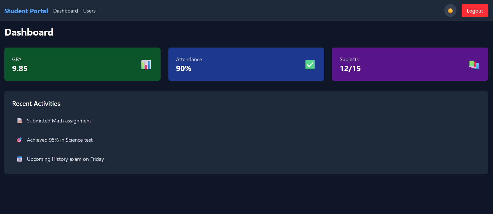

# 🎓 Student Portal



A modern student management portal with authentication, user dashboard, and data visualization built with React and Tailwind CSS.

## 🌐 Live Demo

[View Live on Vercel](https://student-portal-yourusername.vercel.app)

## ✨ Features

### Authentication

🔒 Secure login system with form validation  
👤 Dummy authentication (email: `student@example.com`, password: `password`)  
🚪 Logout functionality

### Dashboard

📊 Interactive summary cards (GPA, Attendance, Subjects)  
📅 Recent activities timeline  
🌙 Dark mode toggle

### User Management

👥 Fetch and display user data from JSONPlaceholder API  
🔄 Loading states and error handling  
📱 Fully responsive design

### UI/UX

🎨 Modern Tailwind CSS styling  
✨ Smooth animations with Framer Motion  
📱 Mobile-first responsive design

## 🛠 Tech Stack

**Frontend**

- React.js (v18)
- React Router (v6)
- Tailwind CSS
- Framer Motion

**API**

- JSONPlaceholder (for dummy user data)

## 📸 Screenshots

| Light Mode                                 | Dark Mode                           |
| ------------------------------------------ | ----------------------------------- |
|  |  |

## 🚀 Getting Started

### Prerequisites

- Node.js (v16+)
- npm (v8+)

### Installation

1. Clone the repository

```bash
git clone https://github.com/Kajal09kumari/StudentPortel
cd StudentPortal
```
